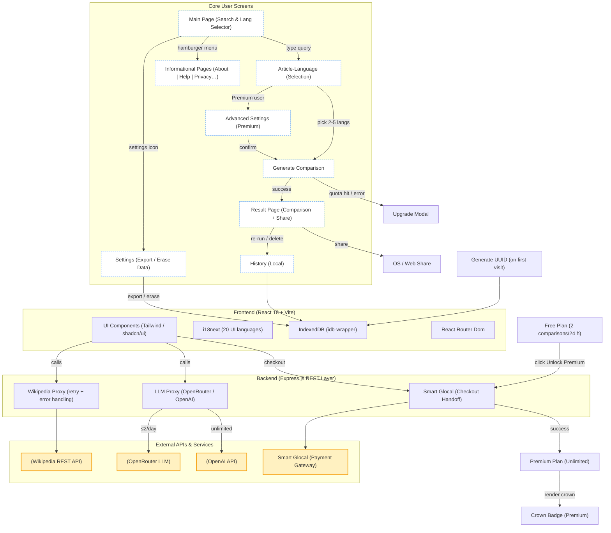

# WikiTruth Platform

A **collaborative web tool** that lets you instantly compare the same Wikipedia article across multiple language editions and GPT models, highlight discrepancies, and export well‑structured reports.

---

## ✨ Key Features

| Category                  | Highlights                                                                                       |
| ------------------------- | ------------------------------------------------------------------------------------------------ |
| **Multi-language diff**   | Side‑by‑side view of the source article and its translations with AI explanations of divergences |
| **AI‑powered comparison** | Uses both OpenAI Chat and OpenRouter models for robust fact‑checking and style analysis          |
| **One‑click export**      | Generate DOCX or shareable links suitable for journalists, students, and researchers             |
| **Privacy‑first**         | No user tracking; all sessions stored in ephemeral Keyv storage                                  |
| **Open architecture**     | Express + Node backend with clear API boundaries and pluggable services                          |

---

## 📐 System Architecture

Below is an updated, **layer‑centric Mermaid diagram** reflecting the current client‑server flow, page navigation, and subscription logic.

**Legend**

* **White nodes** — core SPA pages / UX states
* **Blue nodes** — application layers (Frontend & Backend)
* **Yellow nodes** — external APIs and payment gateway integrations



---

## 🚀 Getting Started

1. **Clone** the repository
2. `pnpm i` — install dependencies
3. `pnpm dev` — start Vite dev server and backend concurrently
4. Open [http://localhost:5173](http://localhost:5173) in your browser

> ℹ️  Add an `OPENAI_API_KEY` and `OPENROUTER_API_KEY` to `.env.local` for full functionality.

---

## 🗂️ Project Structure

```
apps/
  web/          # React/Vite frontend
  api/          # Express backend
packages/
  wikipedia/    # Wikipedia fetch wrapper
  compare/      # GPT comparison logic
  ui/           # Tailwind + shadcn/ui components
```

---

## 🤝 Contributing

PRs welcome! Please open an issue first to discuss your idea.

---

## 📄 License

MIT © 2025 WikiTruth team
